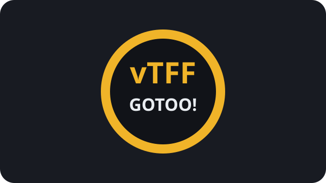

On voulait juste lire un truc, répondre à quelqu'un, regarder une vidéo.

Puis quelque part entre deux notifications, trois onglets et un bouton soigneusement placé, une demi-heure a disparu.

::: punchline
Mon temps n'est pas gratuit.
:::

## Un article doit rester simple à écrire

Le but du builder est que la source ressemble encore à du texte et pas à une page web en chantier.

On peut écrire un [lien hypertexte](https://example.org), ajouter une citation :

> Une interface n'est jamais totalement neutre lorsqu'elle se bat pour notre attention.

::: aside
Une digression reste possible sans casser le fil principal. Le contenu est toujours du Markdown normal, seul le rôle éditorial change.
:::

Et élargir ponctuellement une image sans modifier le template :

::: wide

:::

## Le contrat

Le Markdown reste la source de vérité.

Le HTML est un artefact généré, jetable et reproductible. La mise en page appartient au thème, pas au billet.
